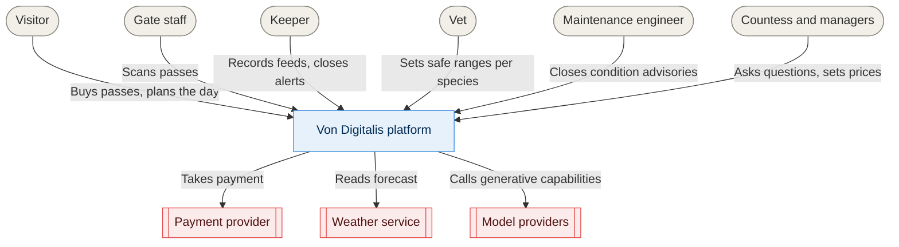

# 01. System context

Who uses the Von Digitalis systems, and what we depend on outside them. Shapes and
colours are defined in the [key](README.md#the-key).

Strawman — argue with it.

## Notes

Six kinds of person, three external dependencies. Only one of those dependencies —
model providers — is volatile (C11), and only two capabilities use it, which is the
argument made in [011](../adrs/011-ai-determinism-tiers.md).

The vet appears as an actor rather than a role inside the estate because
[043](../adrs/043-welfare-loop.md) makes them the authority on what "unwell" means, and
there is no vet on staff by default.

## Open questions

- Are gate staff a distinct actor, or just keepers on a different shift?
- Does a schools or groups booking channel need to appear separately?
- Should the statutory ride inspector appear? They are an authority the system defers to
  but never talks to.
