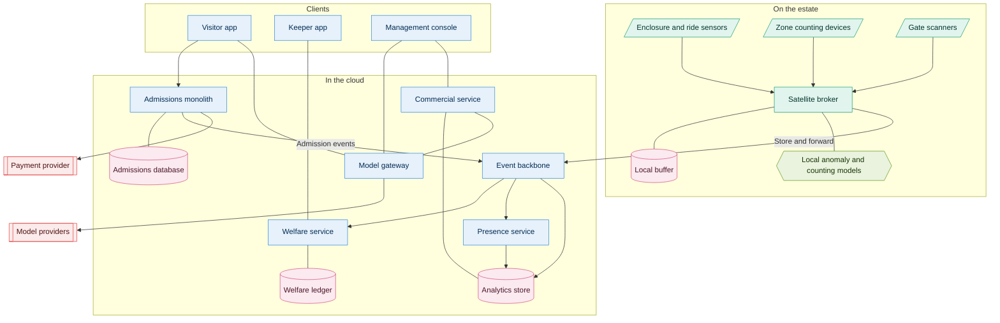

# 02. Container view

The whole system on one page. This is the diagram judges will study, and the one most
likely to be wrong. Shapes and colours are in the [key](README.md#the-key).

Strawman — expect it to change twice.

## What the picture is arguing

The seam from [010](../adrs/010-architecture-style.md) is the point of this diagram.
Everything inside "On the estate" keeps working when the link to the cloud drops.
Everything transactional sits in one box with one database.

Gate scanners publish through the broker rather than calling admissions directly. That
is deliberate: a scan is a fact to be forwarded, not a request needing an answer, which
is what makes offline validation possible in
[012](../adrs/012-admissions-and-ticketing.md).

The model gateway is the only thing that talks to model providers, per
[020](../adrs/020-model-gateway.md). Nothing else does.

## Known problems with this draft

- Twenty-four nodes and already crowded. Something probably has to go.
- The keeper app should arguably sit on the estate, since keepers need it when the link
  is down.
- Ride condition sensing is bundled into "enclosure and ride sensors". D may want it
  separate.
- "Commercial service" is doing a lot of unexamined work — pricing, retention and
  reporting are three different things.
- No line shows the reconciliation path from cloud back to the estate, and there is one.
