# 03. AI capability map

Every place AI appears, grouped by determinism tier, with where it runs and what it is
allowed to do. This is the picture behind
[011](../adrs/011-ai-determinism-tiers.md).

Strawman — the capability list is a proposal, not a decision.

```mermaid
flowchart TB
  rule[Use the lowest tier that works]

  subgraph tier1["Tier 1 — classical, reproducible"]
    anomaly{{Enclosure anomaly detection}}
    intake{{Feed intake monitoring}}
    forecast{{Demand forecasting}}
    propensity{{Retention propensity}}
  end

  subgraph tier2["Tier 2 — perceptual, ground truth available"]
    population{{Piranha population estimate}}
    presence{{Zone counting}}
    condition{{Ride condition signature}}
  end

  subgraph tier3["Tier 3 — generative, justification required"]
    concierge{{Visitor concierge}}
    copilot{{Operations copilot}}
  end

  advises([Advises a person])
  acts[Acts within human-set bounds]

  anomaly --> advises
  intake --> advises
  population --> advises
  condition --> advises
  concierge --> advises
  copilot --> advises
  presence --> acts
  forecast --> acts
  propensity --> acts

  classDef t1 fill:#EAF3DE,stroke:#639922,color:#173404
  classDef t2 fill:#FAEEDA,stroke:#BA7517,color:#412402
  classDef t3 fill:#EEEDFE,stroke:#7F77DD,color:#26215C
  classDef edge fill:#E1F5EE,stroke:#1D9E75,color:#04342C
  classDef cloud fill:#E6F1FB,stroke:#378ADD,color:#042C53
  classDef human fill:#F1EFE8,stroke:#888780,color:#2C2C2A
  classDef store fill:#FBEAF0,stroke:#D4537E,color:#4B1528
  classDef ext fill:#FCEBEB,stroke:#E24B4A,color:#501313

  class anomaly,intake,forecast,propensity t1
  class population,presence,condition t2
  class concierge,copilot t3
  class advises human
  class acts cloud
```

## Where each one runs, and how we know it works

| Capability | Tier | Runs | How we know it works | ADR |
|---|---|---|---|---|
| Enclosure anomaly detection | 1 | Estate | Keeper closes each alert real or not real | [043](../adrs/043-welfare-loop.md) |
| Feed intake monitoring | 1 | Estate | Reconciles against feed store issuance | [043](../adrs/043-welfare-loop.md) |
| Demand forecasting | 1 | Cloud | Forecast against actual admissions | [061](../adrs/061-demand-forecasting-and-pricing.md) |
| Retention propensity | 1 | Cloud | Holdout groups measure uplift | [064](../adrs/064-retention-and-offers.md) |
| Piranha population estimate | 2 | Estate | Reconciled nightly against a keeper stock ledger | C, not yet written |
| Zone counting | 2 | Estate | Reconciled against gate admission totals | C, not yet written |
| Ride condition signature | 2 | Estate | Engineer finding on every advisory; inspection outcomes | [060](../adrs/060-ride-condition-monitoring.md) |
| Visitor concierge | 3 | Cloud | Golden question set and grounding checks | [062](../adrs/062-visitor-concierge.md) |
| Operations copilot | 3 | Cloud | Generated query shown to the human who reads it | [063](../adrs/063-operations-copilot.md) |

## The argument this picture makes

Seven of nine are Tier 1 or 2. Both Tier 3 capabilities only advise. Every Tier 1 and 2
capability runs on the estate, so it survives a link failure and costs nothing per call.

That is the answer to three judging criteria at once: AI uncertainty is confined to two
capabilities behind one gateway; verification has a named mechanism in every row; and
nothing non-deterministic holds authority over safety or money.

## Open questions

- Is zone counting genuinely autonomous, or does "acts" overstate it? It produces
  numbers that inform staffing, which a human then decides.
- Should feed intake be Tier 2? A body-condition scorer is perceptual even if the load
  cells are not.
- Is nine too many to build credibly in the time we are describing? Phasing may need to
  appear in the overview.
